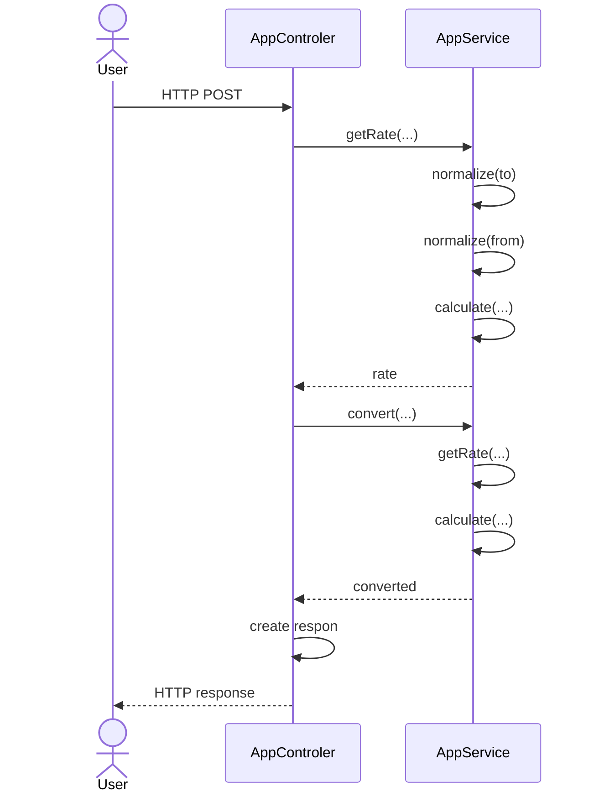

```mermaid
sequenceDiagram
    actor User
    participant AppControler
    participant AppService

    User->> AppControler: HTTP POST
    AppControler ->> AppService: getRate(...)
    AppService ->> AppService: normalize(to)
    AppService ->> AppService: normalize(from)
    AppService ->> AppService: calculate(...)
    AppService -->> AppControler: rate

    AppControler ->> AppService: convert(...)
    AppService ->> AppService: getRate(...)
    AppService ->> AppService: calculate(...)
    AppService -->> AppControler: converted
    
    AppControler ->> AppControler: create respon
    AppControler -->> User: HTTP response
```
