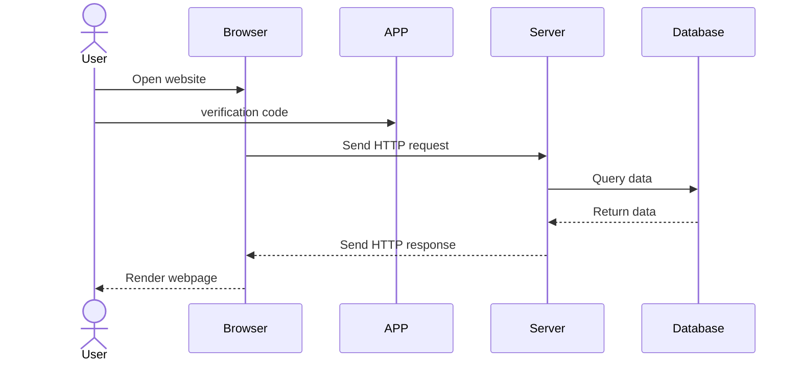

```mermaid
sequenceDiagram
    actor User
    participant Browser
    participant APP
    participant Server
    participant Database
    
    User->> Browser: Open website
    User->> APP: verification code
    Browser->>Server: Send HTTP request
    Server->>Database: Query data
    Database-->>Server: Return data
    Server-->>Browser: Send HTTP response
    Browser-->>User: Render webpage
    
    
```

