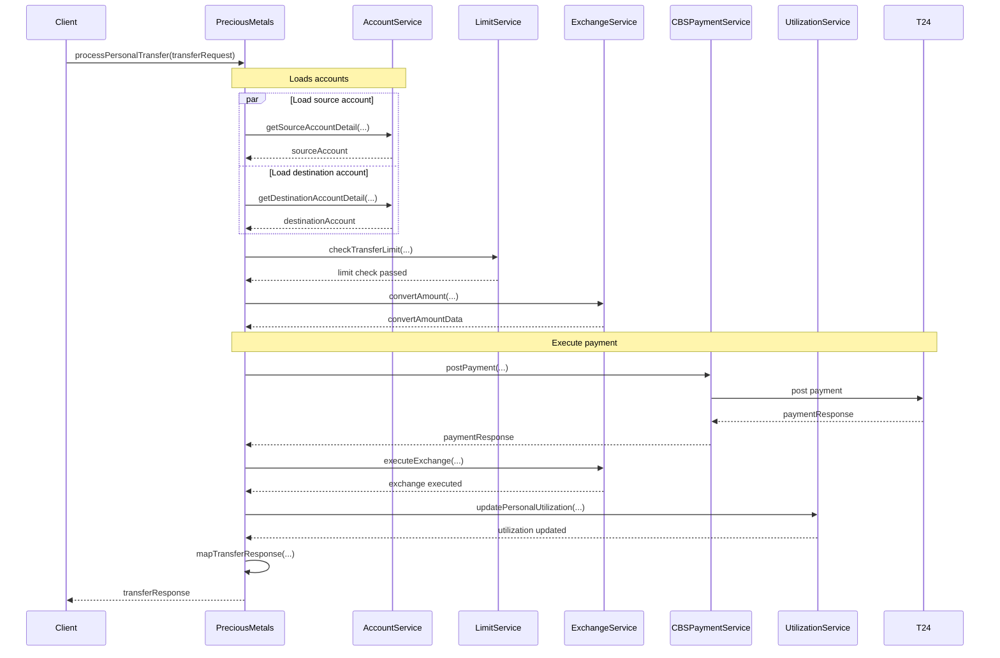

```mermaid
sequenceDiagram
    participant Client
    participant PreciousMetals
    participant AccountService
    participant LimitService
    participant ExchangeService
    participant CBSPaymentService
    participant UtilizationService

    Client->>PreciousMetals: processPersonalTransfer(transferRequest)

    note over  PreciousMetals, AccountService : Loads accounts 
    par Load source account
        PreciousMetals->>AccountService: getSourceAccountDetail(...)
        AccountService-->>PreciousMetals: sourceAccount
    and Load destination account
        PreciousMetals->>AccountService: getDestinationAccountDetail(...)
        AccountService-->>PreciousMetals: destinationAccount
    end

    PreciousMetals->>LimitService: checkTransferLimit(...)
    LimitService-->>PreciousMetals: limit check passed

    PreciousMetals->>ExchangeService: convertAmount(...)
    ExchangeService-->>PreciousMetals: convertAmountData
    
    note over PreciousMetals, T24 : Execute payment
        PreciousMetals->>CBSPaymentService: postPayment(...)
        CBSPaymentService->>T24: post payment
        T24-->>CBSPaymentService: paymentResponse
        CBSPaymentService-->>PreciousMetals: paymentResponse
    
        PreciousMetals->>ExchangeService: executeExchange(...)
        ExchangeService-->>PreciousMetals: exchange executed
    
        PreciousMetals->>UtilizationService: updatePersonalUtilization(...)
        UtilizationService-->>PreciousMetals: utilization updated

    PreciousMetals->>PreciousMetals: mapTransferResponse(...)


    PreciousMetals-->>Client: transferResponse
```

