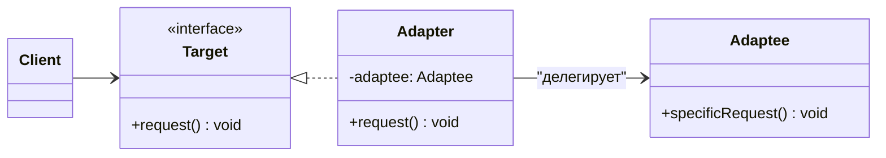
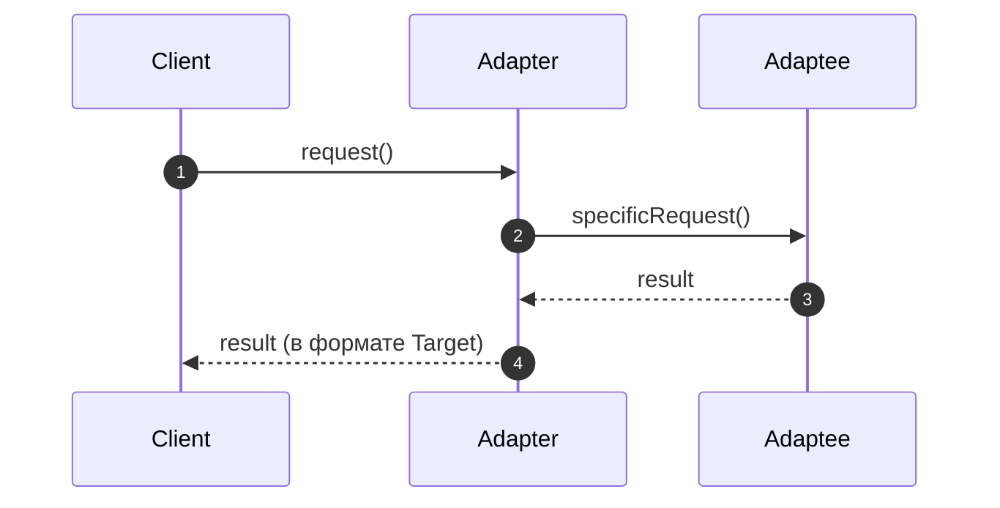

```mermaid
classDiagram
direction LR
class Client
class Target {
<<interface>>
+request() void
}
class Adapter {
-adaptee: Adaptee
+request() void
}
class Adaptee {
+specificRequest() void
}

Client --> Target
Target <|.. Adapter
Adapter --> Adaptee : "делегирует"

```

```mermaid
sequenceDiagram
    autonumber
    participant Client
    participant Adapter
    participant Adaptee
    Client->>Adapter: request()
    Adapter->>Adaptee: specificRequest()
    Adaptee-->>Adapter: result
    Adapter-->>Client: result (в формате Target)
```
