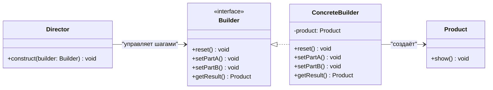
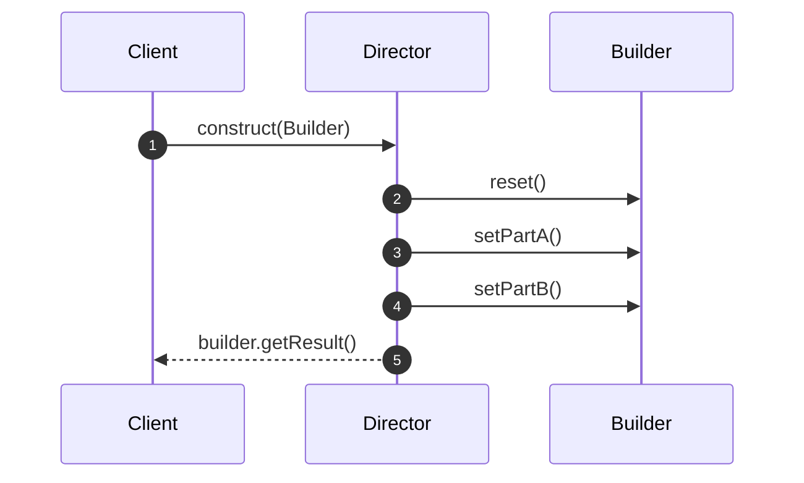

```mermaid
classDiagram
    direction LR
    class Director {
        +construct(builder: Builder) void
    }
    class Builder {
        <<interface>>
        +reset() void
        +setPartA() void
        +setPartB() void
        +getResult() Product
    }
    class ConcreteBuilder {
        -product: Product
        +reset() void
        +setPartA() void
        +setPartB() void
        +getResult() Product
    }
    class Product {
        +show() void
    }

    Director --> Builder : "управляет шагами"
    Builder <|.. ConcreteBuilder
    ConcreteBuilder --> Product : "создаёт"

```

```mermaid
sequenceDiagram
    autonumber
    participant Client
    participant Director
    participant Builder
    Client->>Director: construct(Builder)
    Director->>Builder: reset()
    Director->>Builder: setPartA()
    Director->>Builder: setPartB()
    Director-->>Client: builder.getResult()


```
