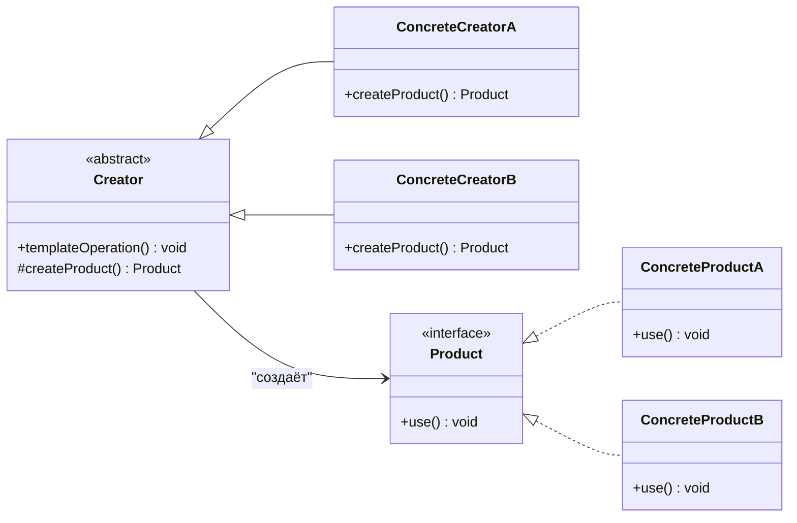
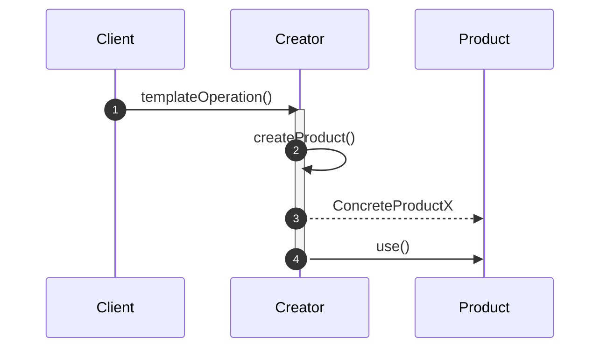

```mermaid
classDiagram
    direction LR
    class Creator {
        +templateOperation() void
        <<abstract>>
        #createProduct() Product
    }
    class ConcreteCreatorA {
        +createProduct() Product
    }
    class ConcreteCreatorB {
        +createProduct() Product
    }
    class Product {
        <<interface>>
        +use() void
    }
    class ConcreteProductA {
        +use() void
    }
    class ConcreteProductB {
        +use() void
    }

    Creator <|-- ConcreteCreatorA
    Creator <|-- ConcreteCreatorB
    Product <|.. ConcreteProductA
    Product <|.. ConcreteProductB
    Creator --> Product : "создаёт"

```

```mermaid
sequenceDiagram
    autonumber
    participant Client
    participant Creator
    participant Product
    Client->>Creator: templateOperation()
    activate Creator
    Creator->>Creator: createProduct()
    Creator-->>Product: ConcreteProductX
    Creator->>Product: use()
    deactivate Creator


```
