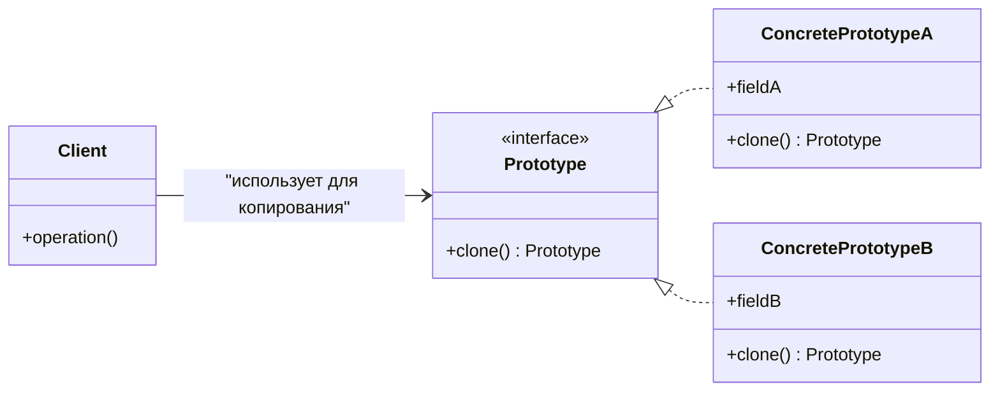
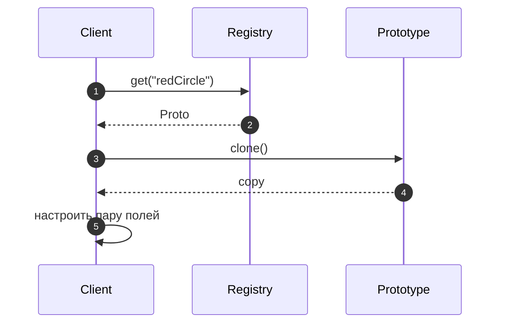

```mermaid
classDiagram
    direction LR
    class Prototype {
        <<interface>>
        +clone() Prototype
    }
    class ConcretePrototypeA {
        +fieldA
        +clone() Prototype
    }
    class ConcretePrototypeB {
        +fieldB
        +clone() Prototype
    }
    class Client {
        +operation()
    }

    Prototype <|.. ConcretePrototypeA
    Prototype <|.. ConcretePrototypeB
    Client --> Prototype : "использует для копирования"

```

```mermaid
sequenceDiagram
    autonumber
    participant Client
    participant Registry
    participant Proto as Prototype
    Client->>Registry: get("redCircle")
    Registry-->>Client: Proto
    Client->>Proto: clone()
    Proto-->>Client: copy
    Client->>Client: настроить пару полей

```
