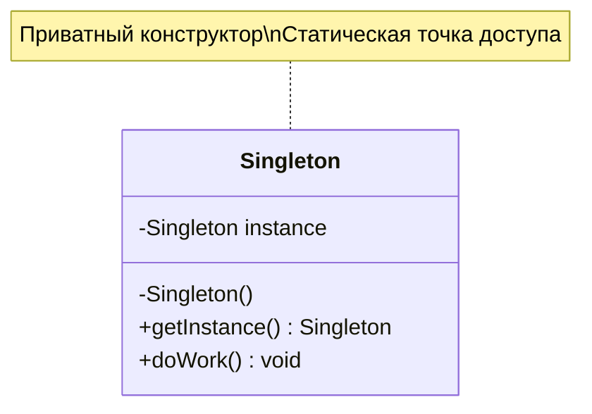
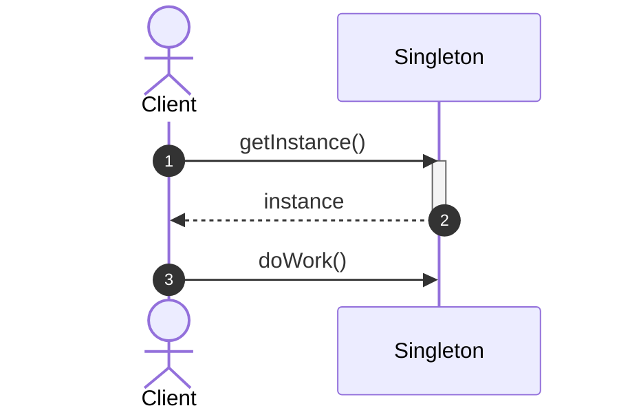

```mermaid
classDiagram
class Singleton {
  -Singleton instance
  -Singleton()
  +getInstance() Singleton
  +doWork() void
}
note for Singleton "Приватный конструктор\nСтатическая точка доступа"
```

```mermaid
sequenceDiagram
    autonumber
    actor Client
    Client->>Singleton: getInstance()
    activate Singleton
    Singleton-->>Client: instance
    deactivate Singleton
    Client->>Singleton: doWork()

```
