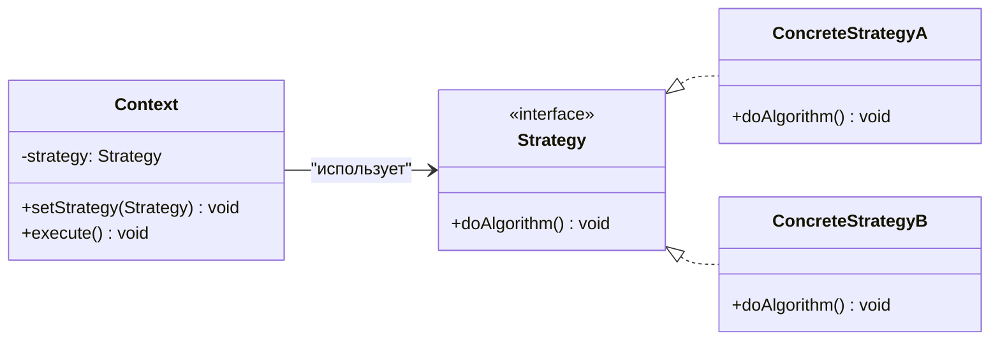
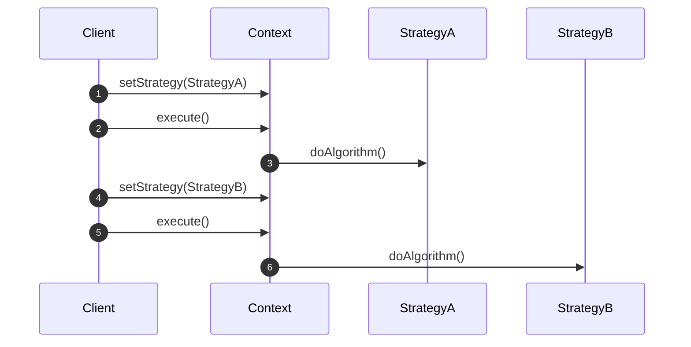

```mermaid
classDiagram
    direction LR
    class Context {
        -strategy: Strategy
        +setStrategy(Strategy) void
        +execute() void
    }
    class Strategy {
        <<interface>>
        +doAlgorithm() void
    }
    class ConcreteStrategyA {
        +doAlgorithm() void
    }
    class ConcreteStrategyB {
        +doAlgorithm() void
    }

    Context --> Strategy : "использует"
    Strategy <|.. ConcreteStrategyA
    Strategy <|.. ConcreteStrategyB

```

```mermaid
sequenceDiagram
    autonumber
    participant Client
    participant Context
    participant StratA as StrategyA
    participant StratB as StrategyB
    Client->>Context: setStrategy(StrategyA)
    Client->>Context: execute()
    Context->>StratA: doAlgorithm()
    Client->>Context: setStrategy(StrategyB)
    Client->>Context: execute()
    Context->>StratB: doAlgorithm()

```
